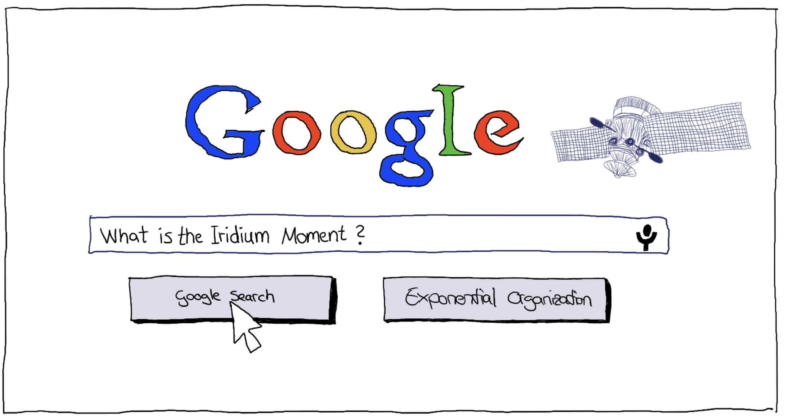
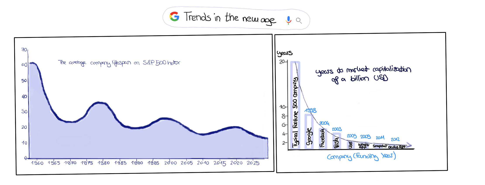

 
 
 # Welcome to my blog on exponential organizations.
 ***Learn more about what's behind the Iridium Moment and why organizations should strive to become a unicorn :unicorn: company . Enjoy reading.*** 

## Have you ever heard of the Iridium Moment? 
 

### If not - here is a short introduction: 
 
 
 The label **Iridium moment** has its origin from the late 1980s as the telecommunications giant motorola unfortunately made a serious strategic dumb decision due to incorrect assessments of future developments. Motorola recognized the coming boom in demand for cell phones, but underestimated the benefits of local radio towers. From Motorola's point of view, these were not sufficiently effective and were comparatively cost-intensive and limited to urban areas. They saw a great opportunity in the expansion of the satellite system and founded the company Iridium with the mission to provide mobile radio coverage all over the world. However, by the time the satellites were up and running, the assumptions on which the strategic decision to establish Iridium was based were no longer valid. By then, the range and performance of masts had improved dramatically and costs had decreased. The use of linear Tools and trends from the past led Motorola to incorrectly predict an accelerating future and thus thus shaped the expression **Irdidium moment**.

 It is not rare that wrong strategic decisions are made on the basis of wrong assumptions and estimates. In particular, the rapid advancement of technology and thus the establishment of mobile devices has led to many miscalculations. 

 | Statements from the 2000s that you wouldn't believe were actually said that way:| | 
 |--------------------------------------------------------------|-----------------| 
 | Steve Jobs (2003): | *"The subscription model for music has failed"*|
 | Paul Krugman *(Nobel Prize winner, well-known economist, advisor to several U.S. presidents)* (1998): | *"The Internet will have no more impact on the economy than the fax machine did"* | 
 |Steve Ballmer *(Ex-CEO Microsoft)* (2007):| *"The iPhone will never gain a significant market share in its lifetime. Not a chance."*|

This shows that even the greatest visionaries and thinkers occasionally misjudge some of the rapid developments and the associated social change. 

Even large consulting firms, which are often hired for strategic orientation, have fallen victim to the Iridium effect. 
| For example, the consulting firm McKinsey once advised AT&T not to enter the cell phone business in the 1980s. This recommendation was based on the assumption that there would be less than one million cell phones in use in the year 2000, which, by the way, was off by a factor of 100 and resulted in AT&T missing a huge opportunity.| 
|--|  

## Reflection and Theoretical Approach to an exponential Age

If we take a look at the history of technological and social development, this may not be surprising: 

**Task:** 
    Everyone is probably familiar with the situation where parents talk about the past and how crazy it is all that has happened in that time. Especially when stories are unwrapped about how they spent hours on the phone using a pay phone or then had their first computer. I'm 24 years old now and just reflecting I find myself in that amazement. The first real smartphones for the general population (no comparison to today of course) with internet access via tablets, flat screen TVs, IoT and smart homes and much more and now we are in the age of Metaverse. Take two minutes and realize what you have witnessed so far and what technologies of tomorrow are just around the corner. Hard to process, isn't it?

**Brief Excursus:** 
I would like to introduce to you here two great thinkers Gordon Moore and Ray Kurzweil who have properly grasped and anchored the dynamics of developments in future ages within their laws. Since the understanding of Moore's Law and the Law of Accelerating Returns of Kurzweil is essential for the understanding how we entered the Exponential Age, a short theoretical excursus will be made in the following. 

1. **Moore's Law**

    In 1965, Gordon Moore made a prediction that set the pace for our modern digital revolution. From close observation of an emerging trend, Moore deduced a dramatic increase in computing power and a decrease in relative cost - on an exponential scale. And he was right! The exponential improvement he predicted was evident in the transformation of the first clumsy home computers of the 1970s into the sophisticated PCs and laptops of the 1980s and 1990s, leading from there to the rise of high-speed Internet, as well as the smartphones, Internet-connected cars, refrigerators and thermostatic valves we take for granted today.

    Simplified, [Moore’s Law](https://www.synopsys.com/glossary/what-is-moores-law.html) states that the price/performance ratio of computers is doubling every eighteen months.

2. **Kurzweil's Law of Accelerating Returns and further observations**

    Building on the duplication pattern identified by Moore, Kurzweil determined that this pheomenon applies to every information technology ([Law of Accelerating Returns](https://www.kurzweilai.net/the-law-of-accelerating-returns)) and proved this by analyzing computer technology up to the year 1990. He identified information as the driving force behind it. Once a field, discipline, technology or industry becomes information enabled and driven by information flows, the price/performance doubles approximately annually, and once that doubling starts, it doesn't stop. He cited artificial intelligence (AI), robotics, biotechnology and bioinformatics, medicine, neuroscience, data science, 3D printing, nanotechnology, and even aspects of energy as key technologies that are information-based and therefore follow the same trajectory

    Intersecting technologies accelerate the pace of innovation even further - as each crossover adds another multiplier to the equation.

So if we look back now at the tremendous upheavals that have taken place in the business world over the last 15 years, the next fifteen years will make those upheavals seem tame by comparison. 

### Deep dive new age of exponential world

#### Deriving from Kurzweil's and Moore's thinking, the new age is characterized by the following 2 major trends: 

| The speed with which new companies reach market capitalization has risen sharply, but the lifespan of company is going to become shorter and shorter. |
|--|

Examples: YouTube went from a startup funded by Chad Hurley’s personal credit cards to being purchased by Google for $1.4 billion, all in less than eighteen months. Groupon leapt from conception to $6 billion in value in less than two years. Uber is valued at almost $17 billion, ten times its value of just two years ago.
- *In ten years, 40 percent of existing Fortune 500 Companies would no longer survive.*
- The Average lifespan of an S&P 500 company has decreased from sixty-seven years in the 1920s to fifteen years today. And that lifespan is going to get even shorter in the years.
- For example, a typical CPG (Consumer Packaged Goods) company like Johnson & Johnson or Proctor & Gamble takes about 300 days to go from a new idea to a product on a Walmart shelf. Quirky, a leading ExO, does that same process — new idea to product on a Walmart shelf — in just 29 days

#### All are affected
Of course, the growing speed also increases the complexity of how business models are built and structured today. But not only new companies, but also long-established ones have to adapt to this. Because not even giant companies are immune from being wiped out by what seems to be a new breed of companies overnight, harnessing the power of exponential technologies, from groupware and data mining to synthetic biology and robotics. This has been demonstrated by the inability to adapt in accordance with rapid change of entire one-great-industry-dominant companies like Kodak, Polaroid, Blockbuster, Nokia among others. 

In order to understand what it takes for businesses to adapt to the new age, we must first gain an understanding of what constitutes this new age: 

1. neither age nor size nor reputation nor even current sales guarantee that you will be around tomorrow
2. with a minimum of resources and time you can build an organization that is sufficiently scalable, fast moving and smart (compare Airbnb, Uber)

:arrow_right: **This new age calls for a different solution to building new business, to improving rates of success and to solving the challenges that lie ahead. It is clear, however, that in our information-based world that is developing exponentially, linear organizational structures cannot be adapted appropriately quickly and flexibly. 
 Therefore: There must be a better way to organize! - An exponential one!**

# New breed of institutional organism: *the exponential organization(ExO)*

## Definition:
An Exponential Organization (ExO :rocket:) is one *"whose impact (or output) is disproportionally large—at least 10x larger—compared to its peers because of the use of new organizational techniques that leverage accelerating technologies"* (Ismail, 2014). 

 :arrow_right: There are two major assumptions on which this new way of running businesses is built: 
 1. **"Rent, Don’t own Access resources you don’t own"**: *ExOs rather use external resources than owning their own assets or workforce.*
 2. **"Information accelerates everything and is therefore your greatest asset"**. *(information-based environment delivers fundamentally disruptive opportunities)* 

 To summarize it: ExOs are built upon information technologies that take what was once physical in nature and dematerialize it into the digital, on-demand world.In doing so, they're able to scale their business strategies, culture, organizational frameworks and purpose at the same rate as the technology, i.e. one that follows an exponential curve.
 

Salim Ismail and his co-researchers have studied around 100 companies which has exponentially grown in the last five years and identified the common traits across all the exponential organizations.

The most successful 21st-century companies leverage information and technology to achieve rapid expansion in pursuit of a **Massive Transformative Purpose** (MTP).
Never heard of it? MTP creates a cultural movement by providing the answers to the questions of why you do what you do, why you get up in the morning, and why your organization exists. Consequently, MTP goes beyond the mission statement by reflecting an organization's aspiration to change the world for a better future - that is, not just for economic gain. This is also in line with the growing interest in CSR activities.

### **Further characteristics of an exponential ecosystem:** :rocket:

The formula for Ecos is based on the MTP and the associated external and internal characteristics. To better memorize them, you can use the acronyms *SCALE* and *IDEAS* and/or stick to the metaphor of the two hemispheres of the brain!

 

*Note:  Not every ExO has all ten attributes but the more it has, the more scalable it tends to be.*

**Let's have a closer look on these attributes:**

Start with the external attributes, which can be referred to as **SCALE**:

**S**taff on Demand     
* Leveraging personnel outside the base organization necessary for speed, functionality, flexibility because chances are high that independent of how talented they are, most of them will become obsolete and uncompetitive (challenge and high management effort to keep employees skills up to date - alternative: companies fill their expertise gap with external and temporary workforces)

    * **C**ommunity & Crowd
        * leveraging community and crowd for many functions traditionally handled inside the enterprise, including idea generation, funding, design, distribution, marketing and sales. 
        * **Community:** 
            *"If you build communities and you do things in public, you don’t have to find the right people, they find you."* (Chris Anderson)
            * Internet is producing trait-based communities; in early stages, many companies find it easier to join an existing community that shares its MTP.
            * Three steps to building a community around an ExO:
                * Attract and engage early members by the use of one's MTP
                * Nurture the community by listening and giving back
                * create a platform wo automated peer-to-peer engagement (e.g., GitHub)
        * **Crowd:**  is made up of concentric rings of people outside the core community. 
            * is harder to reach, but its numbers are much greater
            * is pull-based (You open up an idea, funding opportunity or incentive prize…and let people find you)
            * ExOs can leverage the crowd by harnessing:
                * Creativity, innovation --> idea generation 
                * Validation
                * Crowdfunding

 

 

    * **A**lgorithms
        * two major types of algorithms: 
            * **Machine Learning:** is the ability to accurately perform new, unseen tasks, built on known properties learned from training or historic data, and based on prediction. 
            * **Deep Learning**: is a new and exciting subset of Machine Learning based on neural net technology. It allows a machine to discover new patterns without being exposed to any historical or training data.

        * Companies that are data-driven help to prevent fall prey to self-delusions that often happen when you solely rely on intuitive guesses of the company's leaders. 
        * | **Brief Excursus (cognitive biases):**|| 
            |------|-----| 
            Anchoring Bias:| 
            Availability heuristic: | 
            Confirmation bias: | 
            Framing bias:  | 
            Optimism bias:  | 
            Cognitive dissonance | 
            Framing effect | 
            Prospect theory | 
            ... | 

        * 4 Steps for ExOs to implement algorithms: 
            * Gather data via humans or sensors 
            * Organize the data (extract, transform and load)
            * Apply by using machine learning tools to identify trends and tune new algorithms 
            * Expose --> Open data and APIs can be used to enable an ExO’s community to develop valuable services, new functionalities and innovation layered on top of the platform by remixing the ExO’s data with their own. 
        

    * **L**everaged Assets
        * Outsource even mission-critical assets to retain flexibility
        * Scale and Share asstes not only locally but also globally through technology
        * The ability to lease on-demand computing that would scale on a variable cost basis utterly changed the IT industry.
        * collaborative consumption
       *  NOTE: When the asset in question is rare or extremely scarce, then ownership is a better option. But if your asset is information-based or commoditized at all, then accessing is better than possessing.
 
    * **E**ngagement
        * Key attributes: 
            * Ranking transparency 
            * Self-efficacy (sense of control, agency and impact) 
            * Peer pressure (social comparison) 
            * Eliciting positive rather than negative emotions to drive long-term behavioral change 
            * Instant feedback (short feedback cycles) 
            * Clear, authentic rules, goals and rewards (only reward outputs, not inputs) 
            * Virtual currencies or points

- **IDEAS** (internal attributes) 
    * **I**nterfaces
        * algorithms and automated workflows that route the output of SCALE externalities to the right people at the right time internally.
        * filtering and matching processes by which ExOs bridge from SCALE externalities to internal IDEAS control frameworks
        * results in more effective and efficient processes, reducing the margin of error.
        * Interfaces tend to become the most distinctive internal characteristics of a fully realized ExO (Most of these Interface processes are unique and proprietary to the organization that developed them).
        * they are the core levers by which any ExO can manage to scale 

    | Uber | 
    |--|
        Uber 
       1. Interface: Driver selection 
       2. Description: System to allow users to find and choose drivers 
       3. Internal Usage: Algorithm matches best/closest driver to user location 
       4. SCALE Attribute: Algorithm
    |--|

    * **D**ashboards 
        * in order to measure and manage --> a real-time, adaptable dashboard 
        * Traditional vanity metrics (stats such as the number of visitors or mobile app downloads) are being replaced by real value metrics including repeat usage, retention percentage, monetization and Net Promoter Score (NPS).
        * OKR Method (Invented at Intel by CEO Andy Grove and brought to Google by venture capitalist John Doerr in 1999)
            * tracks individual, team and company goals and outcomes in an open and transparent way.
            * Never heard ot the OKR method - in the text box below are some facts! 
    * **E**xperimentation
        * testing assumptions and constantly experimenting with controlled risks (lean startup methodology) 
        * the practice of kaizen: constant improvement as a fundamental process management technique.
        * Prototyping: Lean Startup movement, which was created by Eric Ries and Steve Blank and is based on Ries’s book of the same name.
            * Lean Approach: Learn, Build, Measure (Ideas, Code, Data) 

    * **A**utonomy
        * self-organizing, multi-disciplinary teams operating with decentralized authority.
        * They are also encouraged to start new projects, so long as they fit the company’s MTP. Autonomy is a prerequisite for permissionless innovation.

    * **S**ocial Technologies
        * create horizontal interactions in vertically organized companies.
        * Social Technologies are comprised of seven key elements: Social objects, Activity streams, Task management, File sharing, Telepresence, Virtual worlds and Emotional sensing. When implemented, these elements create transparency and connectedness and, most importantly, lower an organization’s information latency.
        * Priestley’s equation for social business is: CONNECTION + ENGAGEMENT + TRUST + TRANSPARENCY.
        * three key objectives (according to J.P. Rangaswami): 
            * Reduce the distance between obtaining (and processing) information and decision-making
            * Migrate from having to look up information to having it flow through your perception. 
            * Leverage community to build out ideas.

|OKR method: |
|--|
OKR - is a strategy implementation tool agile framework for leadership and goal management that promotes alignment and creates measurable goals. 
The following principles can be attributed to OKR: Alignment, Communication & Transparency, Continuous Learning, Customer Focus & Continuous Value Creation, Engagement & Team Empowerment, Metrics and Data Driven Decision Making, Focus, Purpose Driven Work.
The OKR method is particularly characterized by its success due to transparency through operational and strategic collaboration (60% bottom up and 40% top down) as well as the short and planning and review cycles. 
In fact, the OKR method works in cycles - mostly in a quarterly rhythm. A cycle is composed of the following phases: 
**Drafting of OKRs** (max. 5 per business unit): As the name suggests, the key elements are the Objectives and Key Results: the Objective should define where we want to go.  When drafting **Objectives**, two questions should be asked: Who is our customer? and What value are we creating? The Objectives should have a clear focus on the customer and business value and be qualitative. It is also important to find a balance between inspiration, ambition and feasibility in the drafting process. 
**Key Results** should be used to measure whether the goals have been achieved. These should be quantitative, measurable and, above all, influenceable. They act as lead indicators for the Initiatives. It is important that a maximum of 5 KRs per objective are defined and that they are limited in time. To ensure success, the KRs should be accepted by all stakeholders. 
In the **Alignment Workshop**, the drafted OKRs and their responsibilities are exchanged and dependencies and potential for collaboration are identified. Refinement of OKRs can be done as needed in this phase. 
**Drafting initiatives**: Defining concrete actions to achieve the KRs and Objectives for the upcoming cycle. 
After the Kick-off, **check-ins** are conducted on a bi-weekly basis. Towards the end, the **retroperspective** and **review** takes place. By reflecting and comparing the actual goal realization, the entire work process can be improved for the next OKR cycle and open to.dos can be taken into the drafting of the upcoming cycle. 
Andre Grove developed the new OKR framework in the 1970s. In 1999, John Doerr introduces OKRS to the founders at Google. He is also the author of the later famous bestseller. What really Matters. Since 2000 Google has been using OKRs and growing exponentially. 
Nowadays thousands of companies successfully implemented OKRs: Scout 24, ProSieben, amazon, zalando, Red Bull, Edeka, Burda, N26, Siemens. 
**Example of an OKR from SpaceX:** Strategic level: O: "We have due built first sustainable city on Mars"; KR for Mars mission goal: "We raised 2.5 billion euros for our first unit of wle space travel." . - Project level: I: We launched a crowdfunding campaign on Kickstarter. 

## Some ExOs examples:

Examples for exponential organizations: 
- Google *(MTP: Organizing world’s information)
- Airbnb *(MTP: Everyone belongs everywhere)
* Xiaomi
* TED: Ideas worth spreading.
* Tesla: Accelerate the transition to sustainable transportation
- Uber Transportation as reliable as running water
- Netflix

## Sources:
Ismail, Salim; Malone, Michael S.; van Geest, Yuri. Exponential Organizations: Why new organizations are ten times better, faster, and cheaper than yours (and what to do about it) (p. 13). Diversion Books. Kindle Edition. 