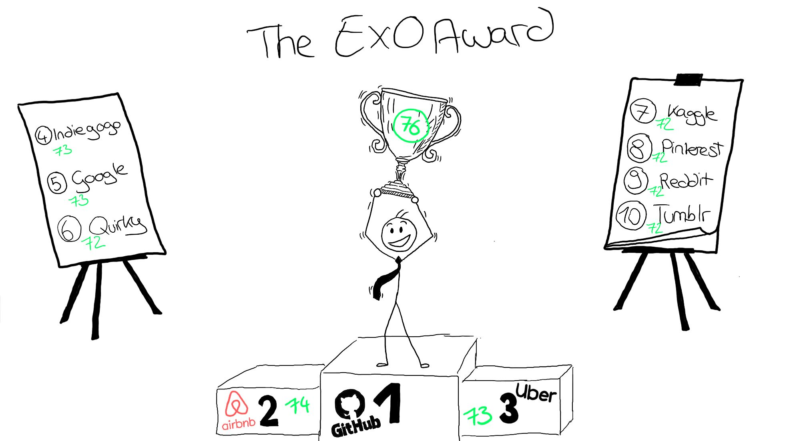

 
 
 # Welcome to my blog on exponential organizations.
 ***Learn more about what's behind the Iridium Moment and why organizations should strive to become a unicorn :unicorn: company . Enjoy reading.*** 

## Have you ever heard of the Iridium Moment? 
 

### If not - here is a short introduction: 

 
 
 The label **Iridium moment** has its origin from the late 1980s as the telecommunications giant motorola unfortunately made a serious strategic dumb decision due to incorrect assessments of future developments. Motorola recognized the coming boom in demand for cell phones, but underestimated the benefits of local radio towers. From Motorola's point of view, these were not sufficiently effective and were comparatively cost-intensive and limited to urban areas. They saw a great opportunity in the expansion of the satellite system and founded the company Iridium with the mission to provide mobile radio coverage all over the world. However, by the time the satellites were up and running, the assumptions on which the strategic decision to establish Iridium was based were no longer valid. By then, the range and performance of local radio towers had improved dramatically and costs had decreased. The use of linear Tools and trends from the past led Motorola to incorrectly predict an accelerating future and thus thus shaped the expression **Irdidium moment**.

 It is not rare that wrong strategic decisions are made on the basis of wrong assumptions and estimates. In particular, the rapid advancement of technology and thus the establishment of mobile devices has led to many miscalculations. 

 | Statements from the 2000s that you wouldn't believe were actually said that way:| | 
 |--------------------------------------------------------------|-----------------| 
 | Steve Jobs (2003): | *"The subscription model for music has failed"*|
 | Paul Krugman *(Nobel Prize winner, well-known economist, advisor to several U.S. presidents)* (1998): | *"The Internet will have no more impact on the economy than the fax machine did"* | 
 |Steve Ballmer *(Ex-CEO Microsoft)* (2007):| *"The iPhone will never gain a significant market share in its lifetime. Not a chance."*|

This shows that even the greatest visionaries and thinkers occasionally misjudge some of the rapid developments and the associated social change. 

Even large consulting firms, which are often hired for strategic orientation, have fallen victim to the Iridium effect. 
| For example, the consulting firm McKinsey once advised AT&T not to enter the cell phone business in the 1980s. This recommendation was based on the assumption that there would be less than one million cell phones in use in the year 2000, which, by the way, was off by a factor of 100 and resulted in AT&T missing a huge opportunity.| 
|--|  

## Reflection and Theoretical Approach to an exponential Age

If we take a look at the history of technological and social development, this may not be surprising: 

**Task:** 
    Everyone is probably familiar with the situation where parents talk about the past and how crazy it is all that has happened in that time. Especially when stories are unwrapped about how they spent hours on the phone using a pay phone or then had their first computer. I'm 24 years old now and just reflecting I find myself in that amazement. The first real smartphones for the general population (no comparison to today of course) with internet access via tablets, flat screen TVs, IoT and smart homes and much more and now we are in the age of Metaverse. Take two minutes and realize what you have witnessed so far and what technologies of tomorrow are just around the corner. Hard to process, isn't it?

**Brief Excursus:** 
I would like to introduce to you here two great thinkers Gordon Moore and Ray Kurzweil who have properly grasped and anchored the dynamics of developments in future ages within their laws. Since the understanding of Moore's Law and the Law of Accelerating Returns of Kurzweil is essential for the understanding how we entered the Exponential Age, a short theoretical excursus will be made in the following. 

1. **Moore's Law**

    In 1965, Gordon Moore made a prediction that set the pace for our modern digital revolution. From close observation of an emerging trend, Moore deduced a dramatic increase in computing power and a decrease in relative cost - on an exponential scale. And he was right! The exponential improvement he predicted was evident in the transformation of the first clumsy home computers of the 1970s into the sophisticated PCs and laptops of the 1980s and 1990s, leading from there to the rise of high-speed Internet, as well as the smartphones, Internet-connected cars, refrigerators and thermostatic valves we take for granted today.

    Simplified, [Moore’s Law](https://www.synopsys.com/glossary/what-is-moores-law.html) states that the price/performance ratio of computers is doubling every eighteen months.

2. **Kurzweil's Law of Accelerating Returns and further observations**

    Building on the duplication pattern identified by Moore, Kurzweil determined that this pheomenon applies to every information technology ([Law of Accelerating Returns](https://www.kurzweilai.net/the-law-of-accelerating-returns)) and proved this by analyzing computer technology up to the year 1990. He identified information as the driving force behind it. Once a field, discipline, technology or industry becomes information enabled and driven by information flows, the price/performance doubles approximately annually, and once that doubling starts, it doesn't stop. He cited artificial intelligence (AI), robotics, biotechnology and bioinformatics, medicine, neuroscience, data science, 3D printing, nanotechnology, and even aspects of energy as key technologies that are information-based and therefore follow the same trajectory

    Intersecting technologies accelerate the pace of innovation even further - as each crossover adds another multiplier to the equation.

So if we look back now at the tremendous upheavals that have taken place in the business world over the last 15 years, the next fifteen years will make those upheavals seem tame by comparison. 

### Deep dive new age of exponential world

#### Deriving from Kurzweil's and Moore's thinking, the new age is characterized by the following 2 major trends: 

| The speed with which new companies reach market capitalization has risen sharply, but the lifespan of company is going to become shorter and shorter. |
|--|

Examples: YouTube went from a startup funded by Chad Hurley’s personal credit cards to being purchased by Google for $1.4 billion, all in less than eighteen months. Groupon leapt from conception to $6 billion in value in less than two years. Uber is valued at almost $17 billion, ten times its value of just two years ago.
- *In ten years, 40 percent of existing Fortune 500 Companies would no longer survive.*
- The Average lifespan of an S&P 500 company has decreased from sixty-seven years in the 1920s to fifteen years today. And that lifespan is going to get even shorter in the years.

#### All are affected
Of course, the growing speed also increases the complexity of how business models are built and structured today. But not only new companies, but also long-established ones have to adapt to this. Because not even giant companies are immune from being wiped out by what seems to be a new breed of companies overnight, harnessing the power of exponential technologies, from groupware and data mining to synthetic biology and robotics. This has been demonstrated by the inability to adapt in accordance with rapid change of entire one-great-industry-dominant companies like Kodak, Polaroid, Blockbuster, Nokia among others. 

In order to understand what it takes for businesses to adapt to the new age, we must first gain an understanding of what constitutes this new age: 

1. neither age nor size nor reputation nor even current sales guarantee that you will be around tomorrow
2. with a minimum of resources and time you can build an organization that is sufficiently scalable, fast moving and smart (compare Airbnb, Uber)

:arrow_right: **This new age calls for a different solution to building new business, to improving rates of success and to solving the challenges that lie ahead. It is clear, however, that in our information-based world that is developing exponentially, linear organizational structures cannot be adapted appropriately quickly and flexibly. 
 Therefore: There must be a better way to organize! - An exponential one!**

# New breed of institutional organism: *the exponential organization(ExO)*

## Definition:
An Exponential Organization (ExO :rocket:) is one *"whose impact (or output) is disproportionally large - at least 10x larger - compared to its peers because of the use of new organizational techniques that leverage accelerating technologies"* (Ismail, 2014). 

 :arrow_right: There are two major assumptions on which this new way of running businesses is built: 
 1. **"Rent, Don’t own"**: *ExOs rather use external resources than owning their own assets or workforce.*
 2. **"Information accelerates everything and is therefore your greatest asset"**. *(information-based environment delivers fundamentally disruptive opportunities)* 

 To summarize it: 

ExOs are built upon information technologies that take what was once physical in nature and dematerialize it into the digital, on-demand world. In doing so, they're able to scale their business strategies, culture, organizational frameworks and purpose at the same rate as the technology, i.e. one that follows an exponential curve. For the first time, the Internet has enabled businesses to exponentially reduce the cost of demand generation through online marketing and referral marketing - in fact, if you achieve a viral loop (e.g. WhatsApp), your acquisition costs go completely to zero.
 
## Characteristics:

Salim Ismail and his co-researchers have studied around 100 companies which has exponentially grown in the last five years and identified the common traits across all the exponential organizations.

The most successful 21st-century companies leverage information and technology to achieve rapid expansion in pursuit of a **Massive Transformative Purpose** (MTP).
Never heard of it? MTP creates a cultural movement by providing the answers to the questions of why you do what you do, why you get up in the morning, and why your organization exists. Consequently, MTP goes beyond the mission statement by reflecting an organization's aspiration to change the world for a better future - that is, not just for economic gain. This is also in line with the growing interest in CSR activities.

Examples of MTPs: 
- Google: *"Organizing world’s information"*
- Airbnb: *"Everyone belongs everywhere"*
- TED: *"Ideas worth spreading"*
- Tesla: *"Accelerate the transition to sustainable transportation"*
- Uber: *"Transportation as reliable as running water"*

### **Further characteristics of an exponential ecosystem:** :rocket:

The formula for ExOs is based on the MTP and the associated external and internal characteristics. To better memorize them, you can use the acronyms *SCALE* and *IDEAS* and/or stick to the metaphor of the two hemispheres of the brain!

 

*Note:  Not every ExO has all ten attributes but the more it has, the more scalable it tends to be. Their research indicates that a minimum of four implemented attributes will achieve the ExO label. SCALE and IDEAS elements are self-reinforcing and integrative.*

### **Let's have a closer look on these attributes:**

Let's tart with the external attributes, which can be referred to as **SCALE**:

###  **S**taff on Demand     
In order to ensure speed, functionality and flexibility, the use of personnel outside the core organization is necessary as there is a high probability that most of them, regardless of how talented they are, will become obsolete and uncompetitive. Keeping the skills of employees up to date would be an incredible challenge is connected with high management cost and reduces flexibility, which is why ExOs fill knowledge gaps in the company with external and temporary workers. 

### **C**ommunity & Crowd
ExOs harness the wisdom of the crowd by involving and collaborating with the community and crowd to advance many functions traditionally performed within the enterprise, including ideation, funding, design, distribution, marketing and sales.

* **Community:** 
    * *"If you build communities and you do things in public, you don’t have to find the right people, they find you."* (Chris Anderson)
    * Most importantly, this has been facilitated by the Internet as it is very easy to create trait-based communities. Especially in the early stages, many companies find it easier to join an existing community that shares their MTP and thus enter a community and/or build their own community. The latter can be achieved through the following three steps: 
        1. Attract and engage early members by the use of one's MTP
        2. Nurture the community by listening and giving back
        3. create a platform wo automated peer-to-peer engagement (e.g., GitHub)
* A **Crowd**  is pull-based, which means that ExOs publish an idea, a funding opportunity, or a prize as an incentive.... and let people engage. A crowd consists of a larger number of people outside the core community and is comparatively harder to reach. Besides creativity, innovation as well as validation, crowdfunding is probably the most common example in which you may have even participated once yourself. 

 ### **A**lgorithms
There are two major types of algorithms: 
1. **Machine Learning:** is the ability to accurately perform new, unseen tasks, built on known properties learned from training or historic data, and based on prediction. 
2. **Deep Learning**: is a new and exciting subset of Machine Learning based on neural net technology. It allows a machine to discover new patterns without being exposed to any historical or training data.

Companies that are data-driven help to prevent fall prey to self-delusions that often happen when you solely rely on intuitive guesses of the company's leaders. There are whole lists of classifications of bounded rationality of humans. You may have caught yourself even -  though it is very difficult, as this is often done unconsciously - using shortcuts and biases instead of rationally. To name a few:  The Availability heuristic describes the tendency to overestimate the likelihood of events with greater "availability" in memory, which can be influenced by how recent the memories are or how unusual or emotionally charged they may be. Or the self-serving bias, the tendency people have to seek out information and use it in ways that advance their self-interest.                                                                                             
*You are interested in learning more about human bounded rationality and biases? Then klick [here](https://thedecisionlab.com/biases)!* 

|4 Steps for ExOs to implement algorithms: |
|--| 
|1. Gather data via humans or sensors 
|2. Organize the data (extract, transform and load)
|3. Apply by using machine learning tools to identify trends and tune new algorithms 
|4. Expose --> Open data and APIs can be used to enable an ExO’s community to develop valuable services, new functionalities and innovation layered on top of the platform by remixing the ExO’s data with their own.|
 

### **L**everaged Assets
This generally refers to outsourcing - even of mission-critical assets - to maintain flexibility. Technology has enabled us to scale and share resources not only locally, but also globally.  Notably, for example, the ability to rent on-demand computing, which scales on a variable cost basis, has fundamentally changed the IT industry.
*  NOTE: When the asset in question is rare or extremely scarce, then ownership is a better option. But if your asset is information-based or commoditized at all, then accessing is better than possessing.
 
### **E**ngagement
This includes the use of all techniques that serve to maintain interest and involvement of these groups and increase commitment to your common goal. Examples include reputation systems, gamification, loyalty programs, and incentive rewards
* Key attributes: 
    * Ranking transparency 
    * Self-efficacy (sense of control, agency and impact) 
    * Peer pressure (social comparison) 
    * Eliciting positive rather than negative emotions to drive long-term behavioral change 
    * Instant feedback (short feedback cycles) 
    * Clear, authentic rules, goals and rewards (only reward outputs, not inputs) 
    * Virtual currencies or points

### Let's tart with the internal attributes, which can be referred to as **IDEAS** 

### **I**nterfaces

Interfaces are one of the most important enablers for ExOs and thus represent the most distinctive internal features of a fully realized ExO. They are responsible for filtering and matching processes by which ExOs bridge from SCALE externalities to internal IDEAS control frameworks. They are algorithms and automated workflows that route the output of SCALE externalities to the right people at the right time internally and thereby result in more effective and efficient processes, reducing the margin of error. Without such interfaces, the ExO cannot scale, making them increasingly business-critical. As a business grows exponentially, interfaces are critical if an organization is to scale seamlessly, especially on a global scale. 
Most interfaces receive a great deal of attention and a high level of human-centered design thinking is invested in making interface processes ever more optimized and powerful, or in adding more tools or metadata to them. Most interface processes thus represent a unique type of intellectual property that can have significant market value and are therefore also the property of the organization that developed them.

| Firm | Uber | Github |
|--|--|--|
Interface| Driver selection |Version Control system
Description| System to allow users to find and choose drivers | Multiple coders updating software sequentially and in parallel
Internal Usage| Algorithm matches best/closest driver to user location | Platform keeps all contributions in sync
SCALE Attribute| Algorithm |Community & Crowd 

### **D**ashboards 
A real-time, adaptable dashboard is important for ExOs to better measure and manage particularly in regard to the growing amount of data to be stored each year . True value metrics such as repeat usage, retention percentage, monetization, and Net Promoter Score (NPS) are important today, because they can be very useful for companies as KPIs. A data-based goal management method is Objective and Key Results. Never heard of the OKR method - here come some facts!

|OKR method: |
|--|
OKR - is a strategy implementation tool agile framework for leadership and goal management that promotes alignment and creates measurable goals. 
The following principles can be attributed to OKR: Alignment, Communication & Transparency, Continuous Learning, Customer Focus & Continuous Value Creation, Engagement & Team Empowerment, Metrics and Data Driven Decision Making, Focus, Purpose Driven Work.
The OKR method is particularly characterized by its success due to transparency through operational and strategic collaboration (60% bottom up and 40% top down) as well as the short and planning and review cycles. 
In fact, the OKR method works in cycles - mostly in a quarterly rhythm. A cycle is composed of the following phases: 
**Drafting of OKRs** (max. 5 per business unit): As the name suggests, the key elements are the Objectives and Key Results: the Objective should define where we want to go.  When drafting **Objectives**, two questions should be asked: Who is our customer? and What value are we creating? The Objectives should have a clear focus on the customer and business value and be qualitative. It is also important to find a balance between inspiration, ambition and feasibility in the drafting process. 
**Key Results** should be used to measure whether the goals have been achieved. These should be quantitative, measurable and, above all, influenceable. They act as lead indicators for the Initiatives. It is important that a maximum of 5 KRs per objective are defined and that they are limited in time. To ensure success, the KRs should be accepted by all stakeholders. 
In the **Alignment Workshop**, the drafted OKRs and their responsibilities are exchanged and dependencies and potential for collaboration are identified. Refinement of OKRs can be done as needed in this phase. 
**Drafting initiatives**: Defining concrete actions to achieve the KRs and Objectives for the upcoming cycle. 
After the Kick-off, **check-ins** are conducted on a bi-weekly basis. Towards the end, the **retroperspective** and **review** takes place. By reflecting and comparing the actual goal realization, the entire work process can be improved for the next OKR cycle and open to.dos can be taken into the drafting of the upcoming cycle. 
Andrew Grove developed the new OKR framework in the 1970s (Book recommendation: [*“High Output Management”*](https://www.thalia.de/shop/home/artikeldetails/A1003138903)). 
OKRs at Google: In 1999, John Doerr introduces OKRS to the founders at Google. He is also the author of the later famous bestseller: [*"Measure What Matters"*](https://www.whatmatters.com). Since 2000 Google has been using OKRs and growing exponentially. OKRs at Google are part of the culture, DNA and of the language that you use at Google --> sehr verankert. For a deepdive have a look on this video: [How Google sets goals OKRs](https://www.youtube.com/watch?v=mJB83EZtAjc).
The success of the OKR method has also encouraged investment in tools to simplify and manage OKRs. For example, Google itself uses several OKR tools such as Google Sites, Wikis, and Google Spreadsheets. While the formulation and measurement of goals takes place in Google Docs and Sheets for many teams, Google has also developed its own measures, such as the customizable tool to evaluate OKRs.
Nowadays thousands of companies successfully implemented OKRs: Scout 24, ProSieben, amazon, zalando, Red Bull, Edeka, Burda, N26, Siemens. 
**Example of an OKR from SpaceX:** Strategic level: O: "We have due built first sustainable city on Mars"; KR for Mars mission goal: "We raised 2.5 billion euros for our first unit of wle space travel." . - Project level: I: We launched a crowdfunding campaign on Kickstarter. 

### **E**xperimentation
This refers to the testing of assumptions and constant experimentation with controlled risks. This allows processes to be adapted to the rapidly changing external factors and huge and quick learnings. You may already be familiar with this from the start-up environment, such as the [lean startup methodology](https://www.universitylabpartners.org/blog/what-is-lean-startup-methodology). It involves a continuous loop of  (ideas) building, (code) measuring, (data) learning and thus a continuous improvement process, as proposed by Kaizen. Also the prototyping (Eric Ries) in which a Mininmum-Viable Product is built on which then the iteration loops start is to be emphasized in this context. In general, this enables faster time to a product launch. Thus, experimentation can help maximize value creation in different ways. 

### **A**utonomy
Autonomy was describes by Ismail as self-organizing, multi-disciplinary teams operating with decentralized authority.In ExOs employees should be encouraged to start new projects, so long as they fit the company’s MTP. Thereby, Autonomy is becoming a prerequisite for permissionless innovation.

 ### **S**ocial Technologies
Social technologies create horizontal interactions in vertically organized companies. They foster the speed of decision cycles, learning, and are able to stabilize the team during rapid growth.  Social technologies are composed of seven key elements: Social objects, activity streams, task management, file sharing, telepresence, virtual worlds, and emotional awareness. When implemented, these elements create transparency and connectedness, and most importantly, reduce an organization's information latency. According to Priestleys equation, a social business requires an interplay of connection, engagement, trust and transparency. J.P. Rangaswami sees shortening the time between acquiring (and processing) information and making decisions, shifting from the need to look up information to the flow of information through your perceptions, and using community to develop ideas as three main goals of social technologies.

## Exponential Organizations - Examples:

While reading the characteristics, you must have already thought of several companies. Using the characteristics of ExO, Ismail et al. have developed a [diagnostic](https://exqsurvey.com) that quantifies the core scalability of an organization and thereby help you assess and analyze your organization. Implementing at least four or more ExO attributes can lead to a 10-fold increase in performance.

Let's take a look at the findings of the company's diagnostics regarding ExO: (maximum score 84 points)

All hundred ExOs can be seen via [here](https://openexo.com/top100/). 

 **Excursus:** The sobriquet "unicorn" was shaped by a groundbreaking [article by venture capitalist Aileen Lee in 2013](https://techcrunch.com/2013/11/02/welcome-to-the-unicorn-club/?guccounter=1) and has been the target state of every founder ever since. 
But how do you become a unicorn and why are they so successful?" Salim Ismail, Mike Malone, Yuri van Geest have explored this question and created a compressed [guide on how to build unicorns](https://openexo.com/exponential-organizations-book/). According to their thesis, the ability to scale one's organizational structures in a completely new way is what makes companies unicorns.The same is essential for exponential organizations. Therefore, it may not be surprising that considerable overlap has been found between ExOs and Unicorns. Of the 100 largest ExOs identified by Ismail et al. 35 are considered Unicorns according to Aileen Lee's list or in Fortune's list. Thus, if you want to be a unicorn, scale your organizational structure beyond the core team and find a way to lower your marginal cost of supply.

## How to become exponential 
Companies can either be established as ExO, or existing companies can take advantage of the ExO philosophy and thus go exponentially.

### Guidance for the foundation of an exponential organization 

1. Select an MTP (Massive Transformative Purpose).
2. Join or Create Relevant MTP Communities
3. Compose a Team - (optimally four people). We recommend a visionary, UX expert, engineering guru and a business/finance expert.
4. Breakthrough Idea - that delivers a minimum 10x improvement over the status quo. Let’s note that we don’t begin with the core idea — that way you’re not tied to a particular solution, but rather the problem space.
5. Build a Business Model Canvas & Find a Business Model
6. Build the MVP - But they iterated rapidly with initial customer data and were ultimately successful.
7. Validate Marketing and Sales
    - **Acquisition:** How do users locate you? (Growth metric)
    - **Activation:** Do users have a great first experience? (Value metric) Retention: Do users come back? (Value metric) 
    - **Revenue:** How do you make money? (Value metric) 
    - **Referral:** Do users tell others? (Growth metric)
8. Implement SCALE and IDEAS
    - **MTP:** Formulate an MTP in a particular problem space, one that all founders feel passionate about. 
    - **Staff on Demand:** Use contractors, SoD platforms wherever possible; keep FTEs to a minimum. 
    - **Community & Crowd:** Validate idea in MTP communities. Get product feedback. Find co-founders, contractors and experts. Use crowdfunding and crowdsourcing to validate market demand and as a marketing technique. 
    - **Algorithms:** Identify data streams that can be automated and help with product development. Implement cloud-based and open source machine and deep learning to increase insights.
    - **Leveraged Assets:** Do NOT acquire assets. Use cloud computing, TechShop for product development. 
    - **Engagement:** Design product with engagement in mind. Gather all user interactions. Gamify where possible. Create a digital reputational system of users and suppliers to build trust and community. Use incentive prizes to engage crowd and create buzz. - Interfaces: Design custom processes for managing SCALE; do not automate until you’re ready to scale. 
    - **Dashboards:** Set up OKR and value, serendipity, and growth metrics dashboards; do not implement value metrics until product finalized (see Step 10). 
    - **Experimentation:** Establish culture of experimentation and constant iteration. Be willing to fail and pivot as needed. 
    - **Autonomy:** Implement lite version of Holacracy. Start with the General Company Circle as a first step; then move onto governance meetings. Implement the GitHub technical and organizational model with radical openness, transparency and permission. 
    - **Social Technologies:** Implement file sharing, cloud-based document management. Collaboration and activity streams both internally and within your community. Make a plan to test and implement telepresence, virtual worlds and emotional sensing.
9. Establish the Culture
10. Ask Key Questions Periodically
    * Who is your customer? 
    * Which customer problem are you solving? 
    * What is your solution and does it improve the status quo by at least 10x? 
    * How will you market the product or service? 
    * How are you selling the product or service? 
    * How do you turn customers into advocates using viral effects and Net Promoter 
    * Scores to drive down the marginal cost of demand? 
    * How will you scale your customer segment? 
    * How will you drive the marginal cost of supply towards zero?

11. Building and Maintaining a Platform - Aim to be a platform
    1. Identify a pain point or use case for a consumer. 
    2. Identify a core value unit or social object in any interaction between a producer and consumer. This could be anything. Pictures, jokes, advice, reviews, information about sharing rooms, tools and car-rides are examples of things that have led to successful platforms. Remember that many people will be both producers and consumers, and use this to your advantage. 
    3. Design a way to facilitate that interaction. Then see if you can build it as a small prototype that you can curate yourself. If it works at that level, it will be worth taking to the next level and scaling. 
    4. Determine how to build a network around your interaction. Find a way to turn your platform user into an ambassador. Before you know it, you’ll be on a roll.

### What is a large and established organization to do? Answer: Transform

### Mid-market companies 
Unlike startups (where you can build all of the internal operations from scratch around exponential growth), with established established companies, the solution is inevitably customized: you must start with what already exists and build from there. In other words, there is no universal template for “going exponential.”

### Example GitHub
As an example, let's take a look at GutHub here. This shows that a company that did not start exponentially has now become one of the top exponential companies. 

GitHub was founded in 2008 by Chris Wanstrath, P.J. Hyett, and Tom Preston-Werner and is an open source coding and collaboration tool and platform.
Within six years, the company's community grew to more than six million developers working together on more than fifteen million open source software projects.
GitHub is notable for its decentralized, responsive, transparent and self-organizing company culture, which relies heavily on social collaboration tools. It actively leverages its community and deploys people or assets as needed to scale beyond its organizational boundaries. As an advantage, it turns out that the hiring prospects in Silicon Valley and even the salaries of software developers largely depend on their individual ratings on GitHub, which is why developers also actively participate on GitHub primarily in their own interest. This secondary benefit further increases the value of the community and the company. In line with further ExO characteristics, GitHub experiments a lot and also uses internal OKR structures. Subsequently, GitHub's platform is a powerful template for the ExO organizational model because it is designed to be collaborative, open, transparent, community-oriented, and staffed with people who are well-equipped and willing to self-select projects. GitHub is at the forefront of ExOs for a reason. It meets all the ExO principles *(compare table below)* and has transformed the open source community as a result. 

|GitHub | | | |
|--|--|--|--|
**MTP:**| *"Social Coding"*| 
**Staff on Demand:**| Use of the Open Source Community for internal work| **Interfaces:** |Adaptation of a number of functions to support users (z.B. Instant Messaging); Main strength: highly automated control mechanism and the Workflow-Management|
**Community & Crowd:**|  New developers (Crowd) are quickly turned into users (Community) due to the collaborative environment. Creation of a new office for all stakeholders to contribute/ learn; open event space available for offline communities  | **Dashboards:** |Monitoring of value metrics about the platform|
**Algorithms**: |Feedback is codified into algorithms and used for improved version control and workflow| **Experimentation:** |continuous and open iteration of new ideas in every department across the organization|
**Leveraged Assets:**| GitHub doesn’t own any of the projects hosted on its platform, which itself runs on the cloud. The company does use some of the software from various projects to enhance the platform itself—thus enlisting users into improving their own work environment.| **Autonomy:**| Dezentralization of Authority and decision-making; Self-organizing Teams, focus on applicants with passion, purpose and initiative|
**Engagement:**|Use of game dynamics; Feedback on new code is accomplished in almost real time| **Social Technologies:** |Use of GitHub internally; Chatroom as the office of the company |

### Large companies 
what is a large and established organization to do? Answer: Transform. Transformation isn’t easy, however. A big company is like a supertanker: it takes a long time to turn. Nonetheless, it can be done.

identified four such strategies for large organizations to deploy in an accelerating business world while still keeping their core operational businesses intact: 
1.	Transform of leadership: 
    * There are 4 ways to transform the leadership layers of a big company: **Education** (Awareness of accelerating technologies); **Board Management** (especially when the company is using OKRs), **Diversity** (in form of putting young people into positions of power and influence), **Leadership Skills** *(six traits characteristics of ExO leaders: Visionary Customer Advocate; Data driven Experimentalist; Optimistic Realist; Extreme Adaptability; Radical Openness; Hyper-confident)
2.	Depending on the current circumstances think about the Creation of an internal ExO, the Acquisition of an ExO or an Investment in an external ExO
3.	Disrupt[X]. Even though this is a very challenging strategy, there is also the possibility of companies leveraging disruptive technologies themselves. 
4.	Implement ExO Lite internally. Companies can also maintain their status quo and then only adopt some of the characteristics of an ExO (SCALE & IDEAS) in specific areas. Any approach to an ExO can accelerate the business processes and strengthen the competitive position of the company. Therefore, at least a Lite version of a ExO transformation is highly recommended. 

# Lets have a look on Google: 
Everyone knows Google. Today, in an era of winner-takes-all markets, there is predominantly one search engine that accounts for 73% of all Internet searches worldwide - Google. In fact, "googeln" was added to the Duden dictionary in 2004 as a verb for searching/researching on the Internet. Which other search engine can make that claim? 

### Google's evolution and success story
 
When Jonathan Rosenberg Senior Vice President of Google wrote the founding strategy for Google in 2002, he defined three main points:
- Technological foundation: each new product should be based on a major technical insight e.g. a new way of applying design or technology to lower the price or increase the functionality of a product.
- Accelerate growth on a global level: the best way to scale up is to develop a platform: a combination of products and services that create new markets and bring people together.
- Openness: Share information with the world. This has already enabled employees to create many innovative solutions to unexpected problems.

According to the analysis by Salim et al., Google has increased its valuation by 2.5x within three years. In 2011, the valuation was $150 billion, and in 2014 it was already $400 billion. The exponential growth can be shown even more explicitly when comparing the beginning revenues to those now. In 2002, Google's revenue was less than half a billion dollars. Ten years later, revenue had increased 125-fold, and the company was generating half a billion dollars every three days. By 2021, Google's total revenues were around $256.74 billion. Alphabet, the parent company of the group, generated a total of about $257.64 billion in the same period. Thus, nearly all of Alphabet's revenue is generated by Google.

Google itself has managed to scale rapidly through its platform model with its search capabilities. At the heart of this staggering growth has been the PageRank algorithm, an algorithm that ranks the popularity of web pages. The algorithms simply respond to the pages that bring the most clicks. After reaching the critical to mass, the AdWords platform enabled the company to provide advertising platforms itself for other companies to build upon. As a result, Google shaped the competitive landscape and the evolution of the online advertising industry, and also influenced other industries dependent on the Internet. Charges for actual clicks on advertisements served as a source of revenue. By matching ads in the environment, what the user is looking for the success rate and thus the revenue is increased.  Here we can already see a key feature of ExOs, as Google does not own the websites that it scans. Thus, Google's marginal cost to running an extra search query is almost zero. In addition to the algorithm, the information assets are of enormous value to Google and enable the incredible scalability.

### The value of data and information to Google

Google is considered one of the most data-driven companies, which must be essential to its success. Data-driven insights also provide an important countersight and reality check to traditional management decisions based on intuition. For almost every business function, Google uses data. For example, in its hiring practices. Google is known for using games to provide data to qualify potential employees. But gamification is also used to overcome challenges and problems with the help of a community.

The value of information in today's world also becomes clear with regard to Google's innovations for generating and profiting from information on a completely different scale. Worth mentioning here is, for example, the Google car with its lidar (light radar), which scans the surroundings with sixty-four lasers. This generates almost a gigabyte of data per second per car and creates a 3D image of its surroundings with a resolution of one centimeter, which can be merged into a live 3D map of the surroundings with a range of about a hundred meters. But it also revolutionizes the quality of information, since it is not just static information, but dynamic information - data that captures how things change. 

Another example is Google Glass, the smart glasses that can record or transmit videos or images in real time as people move throughout the day. 

### Continuous Improvement through experimentation as an essential competitive factor

Despite its innovative business model and the strong positioning of Google, the company is particularly characterized by its drive for continuous improvement and future research to maintain its position in the future. Therefore, Google works under the 70/20/10 rule, whereby 70% of its resources are allocated to its core business, 20% to new products, and 10% to completely new initiatives. This means that 10% of the budget is spent on experimentation aimed at developing breakthrough technologies. With resources, however, not only financial means are meant, but also human resources. For example, Google is known for its employee management and work culture that is very encouraging of creativity and innovation. For example, Google allows each engineer to spend 20% of their time on things they believe will benefit Google the most. Even one of the company's most successful products, Gmail, was developed by an engineer in his spare time. In such a creativity-promoting corporate culture, tolerance of or even a positive approach to failure is also important. The latter can be achieved, for example, through the belief that if projects are ambitious enough, they will deliver valuable technical and user insights even if they fail. Of course, this also calls for management, which should not try to reduce risks or prevent failures, but rather create an environment that is resilient enough to take those risks and deal with missteps. Of particular note in regard of experimentation is the Google[X] lab for new product development - Here, rather than focusing on existing markets like many traditional enterprise labs, they aim to create entirely new markets for the company through moonshot quality ideas from (e.g. life extension, autonomous vehicles, Google Glass, smart contact lenses, Project Loon, etc.).

Google uses three criteria to decide whether or not to pursue an idea. First, it must address a challenge that affects hundreds to millions of people. Second, it must be radically different from existing market solutions. And last, the required technologies must be feasible in the near future. 

Through its algorithms, data-driven decision-making process, dashboards, interfaces,  experimentation investments among other things, Google has made it to 5th place of the 100 identified ExOs. In doing so, Google has scored 73 points of the maximum 84 points from the Exponential Organization Assessment by Ismail et al.. According to its MTP, Google faces and is guided by the question "How can I better organize the world's information?" on a daily basis. Already, numerous innovations from Google's portfolio have already raised the technological standard to a new level and accelerated change. Let's wait and see what's coming next.  

## Sources:
1. Die Erfolgsstory hinter OKRs bei Google. (n.d.). Retrieved November 13, 2022, from https://www.workpath.com/magazin/okr-google
2. Doerr, J., & Page, L. (2018). Measure What Matters: How Google, Bono, and the Gates Foundation Rock the World with OKRs (Illustriert. edition). Portfolio.
3. dpa. (2022, September 9). Internet-Suche: Google.com vor 25 Jahren registriert. Die Zeit. https://www.zeit.de/news/2022-09/09/google-com-vor-25-jahren-registriert?utm_referrer=https%3A%2F%2Fwww.google.com%2F
4. Exponential Quotient (ExQ) Survey. (n.d.). Openexo. Retrieved November 13, 2022, from https://exqsurvey.com/
5. Goeke, N. (2015, December 30). How Google Works Summary. Four Minute Books. https://fourminutebooks.com/how-google-works-summary/
6. Google Inc. - Chronologie und Dienste. (2016). Limes 8. https://limes-8.com/de/unternehmen/google/
7. GV (Director). (2013, May 14). How Google sets goals: OKRs / Startup Lab Workshop. https://www.youtube.com/watch?v=mJB83EZtAjc
8. Hacking, N. S.-G. (2018, May 29). Innovate or die. Medium. https://nadersabry.medium.com/innovate-or-die-eedc81fe2f8d
9. Homepage. (n.d.). What Matters. Retrieved November 13, 2022, from https://www.whatmatters.com/
10. Ismail, S. (2015, April 7). The Secrets of Unicorn Companies (and the 100 Most Scalable Organizations). Singularity Hub. https://singularityhub.com/2015/04/07/the-secrets-of-unicorn-companies-and-the-100-most-scalable-organizations/
11. Ismail, S., Malone, M. S., & Geest, Y. van. (2014). Exponential organizations: Why new organizations are ten times better, faster, and cheaper than yours (and what to do about it) (1. ed). Diversion Books.
12. Ismail, S., Malone, M. S., Geest, Y. van, & Diamandis, P. H. (2017). Exponentielle Organisationen: Das Konstruktionsprinzip für die Transformation von Unternehmen im Informationszeitalter (M. Kauschke, Trans.; 1st edition). Vahlen.
13. Langley, K. (2020, January 9). Why Try to Become an Exponential Organization? Openexo Blog. http://blog.openexo.com/why-try-to-become-an-exponential-organization
14. Let’s build from here—The complete developer platform to build, scale, and deliver secure software. (n.d.). GitHub. Retrieved November 10, 2022, from https://github.com/about
15. Statista Research Department. (2022). Google—Umsatz weltweit 2021. Statista. https://de.statista.com/statistik/daten/studie/541785/umfrage/umsatz-von-google-weltweit/
16. Top100—OpenExO. (n.d.). Retrieved November 10, 2022, from https://openexo.com/top100/
17. Wietlisbach, O. (2017, January 16). Irren ist menschlich: Die grössten Fehlprognosen der Tech-Geschichte. watson.ch. https://www.watson.ch/!460348669