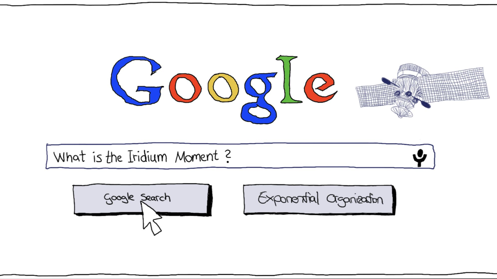
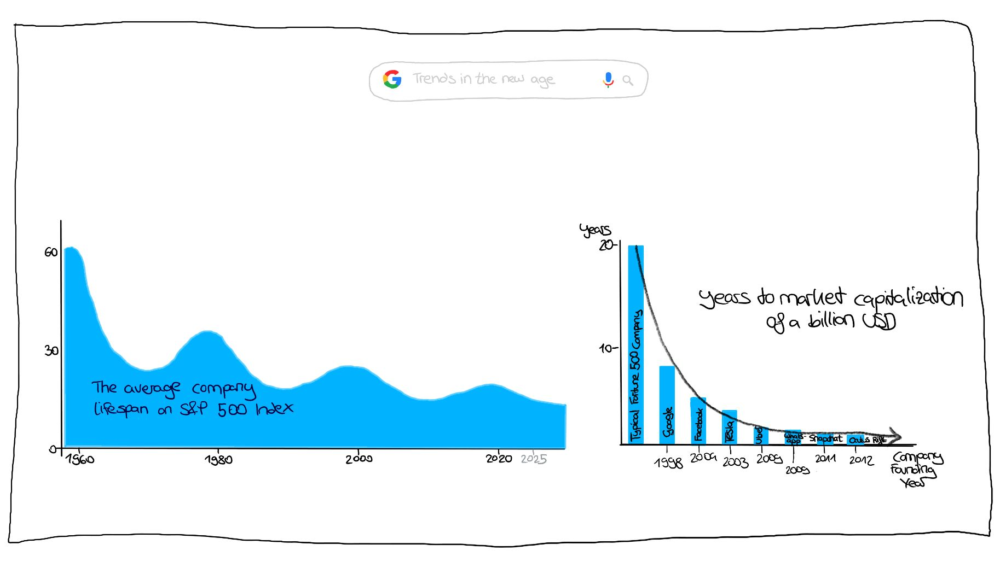
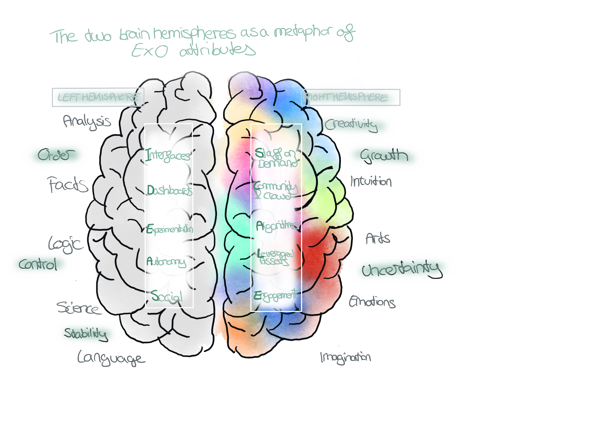
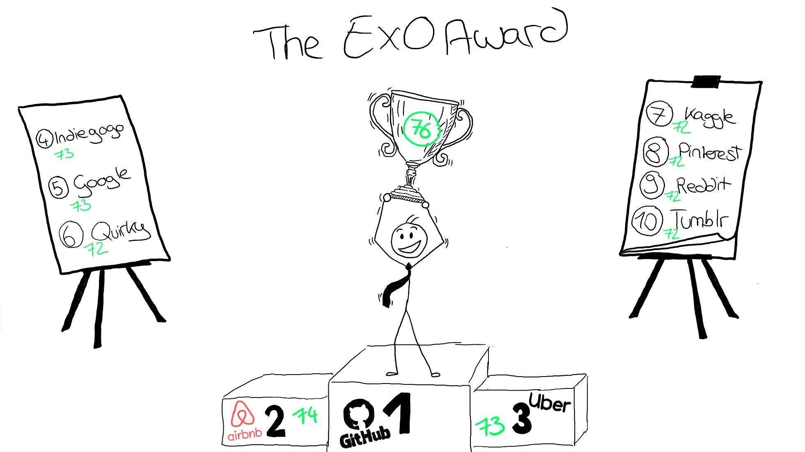

## Welcome to my presentation about Exponential Organizations

subject: Digital Organization 

date: 15.11.2022

author: Theresa Maier 

---

## Have you ever heard of the Iridium Moment? 

---
## Statements from the 2000s that you wouldn't believe were actually said that way:

|Person| *Statement*|
 --------------------------------------------------------------|-----------------| 
 | Paul Krugman *(Nobel Prize winner, well-known economist, advisor to several U.S. presidents)* (1998): | *"The Internet will have no more impact on the economy than the fax machine did"* | 
 |Steve Ballmer *(Ex-CEO Microsoft)* (2007):| *"The iPhone will never gain a significant market share in its lifetime. Not a chance."*|

 ---
### Theoretical Approach to an exponential Age

**Moore's Law**: *The price/performance ratio of computers is doubling every eighteen months*

**Kurzweil's Law of Accelerating Returns**: phenomenon applies to every information technology
* Once a field, discipline, technology or industry becomes information enabled and driven by information flows, the price/performance doubles approximately annually, and once that doubling starts, it doesn't stop.
* Intersecting technologies accelerate the pace of innovation 

---

## The exponential Age 

---

## New breed of institutional organism: *the exponential organization(ExO)*

| Definition:|
|--|
An Exponential Organization (ExO :rocket:) is one *"whose impact (or output) is disproportionally large—at least 10x larger—compared to its peers because of the use of new organizational techniques that leverage accelerating technologies"* (Ismail, 2014). 

--- 
➡️ There are two major assumptions on which this new way of running businesses is built:

1. "Rent, Don’t own": ExOs rather use external resources than owning their own assets or workforce.

2. "Information accelerates everything and is therefore your greatest asset". (information-based environment delivers fundamentally disruptive opportunities)

---

## ExO characteristics 
ExO formula: 
MTP *(Massive Transformative Purpose)* + IDEAS + SCALE

 

---

## Examples of MTPs: 
- Google: *"Organizing world’s information"*
- Airbnb: *"Everyone belongs everywhere"*
- TED: *"Ideas worth spreading"*
- Tesla: *"Accelerate the transition to sustainable transportation"*
- Uber: *"Transportation as reliable as running water"*
 

--- 
## S-C-A-L-E 

1. **Staff of Demand** ➡️ use of personnel outside the core organization 
2. **Community & Crowd** ➡️ harness the wisdom of the crowd & community 
3. **Algorithms** ➡️ Machine Learning & Deep Learning 
4. **Leveraged Assets** ➡️ outsourcing - even of mission-critical assets
5. **Engagement** ➡️ for example: reputation systems, gamification, loyalty programs, and incentive rewards

 

---

## I-D-E-A-S 

1. **Interfaces** ➡️ responsible for filtering and matching processes by which ExOs bridge from SCALE externalities to internal IDEAS control frameworks
2. **Dashboards** ➡️ real-time, adaptable dashboard for measurement and management 
    *  OKRS: 
        * strategy implementation tool & agile framework for leadership and goal management 
        * transparency & alignment (60% bottom up and 40% top down)

---
## I-D-E-A-S 

3. **Experimentation** ➡️ Lean-Start-up Methodology, MVP 
4. **Autonomy** ➡️ self-organizing, multi-disciplinary teams operating with decentralized authority
5. **Social Technologies** ➡️ create transparency and connectedness & reduce an organization's information latency

| *Note:  Not every ExO has all ten attributes but the more it has, the more scalable it tends to be. Their research indicates that a minimum of four implemented attributes will achieve the ExO label. SCALE and IDEAS elements are self-reinforcing and integrative*|
|--|

 

---
## Exponential Organizations - Examples:

---

## How to become exponential 
Companies can either be established as ExO, or existing companies can take advantage of the ExO philosophy and thus go exponentially.

## Lets have a look on Google: 
1. Google's evolution and success story
2. The value of data and information to Google
3. Continuous Improvement through experimentation as an essential competitive factor

---

## Resources
* Ismail, Salim; Malone, Michael S.; van Geest, Yuri. Exponential Organizations: Why new organizations are ten times better, faster, and cheaper than yours (and what to do about it) (p. 83). Diversion Books. Kindle Edition. 

